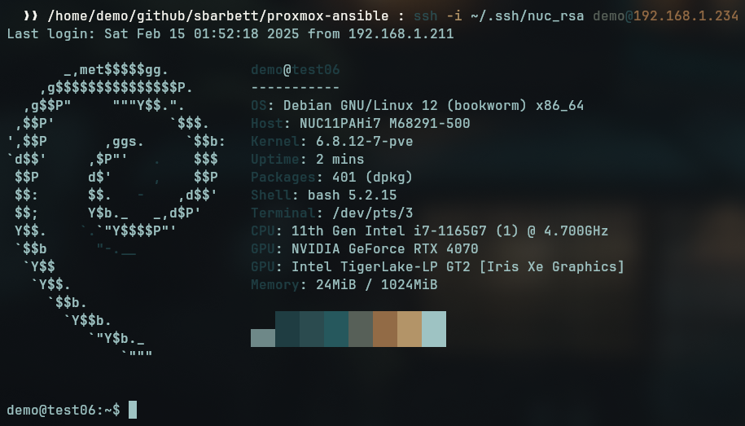

# Ansible Playbooks for Proxmox and LXCs - Part 3

In this episode, we're finally going to get into the LXC we've created and start configuring it with Ansible. We'll add it dynamically as a host, SSH into it, install some software, and more.

## Adding a Dynamic Host

In my last post, I outlined a strategy for acquiring the dynamically assigned IP address from the LXC once it's been spun up. Now, we need to add that IP address to our Ansible hosts. In `roles/proxmox_lxc/tasks/main.yml`, add the following:

```yaml
- name: Add container to dynamic inventory if initial_setup is true
  add_host:
    name: "lxc_{{ container.vmid }}"
    groups: proxmox_containers
    ansible_host: "{{ container_ip }}"
    ansible_connection: ssh
    ansible_user: root
    ansible_ssh_private_key_file: "{{ container.private_key }}"
    ansible_python_interpreter: /usr/bin/python3
    container: "{{ container }}"
  when: container.initial_setup | default(false) and container.get_ip | default(false)
```

Our default Ansible configuration executes everything on localhost. This task adds a new host for Ansible. Let me explain:

* `groups` - The host is added to a group called `proxmox_containers`. The second play in our playbook, which I'll describe shortly, will perform tasks on all hosts within this group. If you're spinning up multiple LXCs and want them all set up, they'll be added here.
* `ansible_host` - The IP of our newly provisioned VM, so Ansible knows where to connect.
* `ansible_connection` - We will connect over `ssh`.
* `ansible_user` - We will connect as the `root` user.
* `ansible_ssh_prvate_key_file` - This specifies the private key corresponding to the public key we uploaded.
* `ansible_python_interpreter` - This tells Ansible to use the default location for Python (i.e., `/usr/bin/python3`) on the container, rather than trying to use the path from our local virtual environment.
* `container` - This passes all the container parameters from the controller to the host.

This task is contingent on the `initial_setup` and `get_ip` flags being set to `true`.

## The Setup Script

I've always used this relatively unsophisticated setup script to provision my new VMs.

```bash
#!/bin/bash

# Check if username and password were provided
if [ "$#" -ne 2 ]; then
  echo "Usage: $0 <username> <password>"
  exit 1
fi

USERNAME=$1
PASSWORD=$2

# Update and upgrade packages
apt update && apt upgrade -y

# Create the user, skip the contact info prompts, and assign the provided password
adduser --gecos "" "$USERNAME" --disabled-password
echo "$USERNAME:$PASSWORD" | chpasswd

# Add user to sudo group
usermod -aG sudo "$USERNAME"

# Install sudo if not installed
apt install sudo -y

# Confirm user creation
echo "User $USERNAME successfully created."

# Prompt to copy SSH key and wait for user to press Enter
echo "Please run 'ssh-copy-id $USERNAME@$(hostname -I | awk '{print $1}')' from your host machine."
read -p "Press <enter> when done."

# Modify the sshd_config file to enable PubkeyAuthentication and disable PasswordAuthentication and root login
sed -i 's/^#PubkeyAuthentication yes/PubkeyAuthentication yes/' /etc/ssh/sshd_config
sed -i 's/^#PasswordAuthentication yes/PasswordAuthentication no/' /etc/ssh/sshd_config
sed -i 's/^#PermitRootLogin prohibit-password/PermitRootLogin no/' /etc/ssh/sshd_config

# Restart SSH service
systemctl restart ssh

# Retrieve the local IP address for the eth0 interface and display it
IP_ADDRESS=$(ip -o -4 addr show dev eth0 | awk '{print $4}' | cut -d/ -f1)
echo "Local address: $IP_ADDRESS"

# Prompt to press Enter before logging out
read -p "Press <enter> when done."

# Log out of the current session
logout
```

I want to achieve the following with Ansible:

1. Update my sources and upgrade my packages.
2. Add a non-root user.
3. Install sudo.
4. Add my new user to the sudo group.
5. Assign a public key to that user.
6. Enable pubkey authentication, disable password authentication, and disable root login.

This is the most rudimentary baseline setup for a Debian box. To translate this into Ansible, I've added the following tasks under `roles/proxmox_lxc/tasks/setup.yml`:

```yaml
- name: Update apt cache and upgrade packages
  apt:
    update_cache: yes
    upgrade: dist
  become: yes

- name: Ensure sudo is installed
  apt:
    name: sudo
    state: present
  become: yes

- name: Create non-root user
  user:
    name: "{{ container.username | default('demo') }}"
    shell: /bin/bash
    create_home: yes
    password: "{{ container.user_password | default('demo123') | password_hash('sha512') }}"
  become: yes

- name: Add user to sudo group
  user:
    name: "{{ container.username | default('demo') }}"
    groups: sudo
    append: yes
  become: yes

- name: Copy SSH public key to demo's authorized_keys
  authorized_key:
    user: "{{ container.username | default('demo') }}"
    state: present
    key: "{{ lookup('file', container.pubkey_file) }}"
  become: yes

- name: Ensure PubkeyAuthentication is enabled in sshd_config
  lineinfile:
    path: /etc/ssh/sshd_config
    regexp: '^#?PubkeyAuthentication'
    line: 'PubkeyAuthentication yes'
  become: yes

- name: Ensure PasswordAuthentication is disabled in sshd_config
  lineinfile:
    path: /etc/ssh/sshd_config
    regexp: '^#?PasswordAuthentication'
    line: 'PasswordAuthentication no'
  become: yes

- name: Ensure PermitRootLogin is disabled in sshd_config
  lineinfile:
    path: /etc/ssh/sshd_config
    regexp: '^#?PermitRootLogin'
    line: 'PermitRootLogin no'
  become: yes

- name: Restart SSH service
  service:
    name: ssh
    state: restarted
  become: yes
```

## Installing `passlib`

The password hashing requires the `passlib` Python module. To install it, update your `bootstrap.yml` file to include:

```yaml
- name: Bootstrap dependencies
  hosts: localhost
  connection: local
  gather_facts: no
  tasks:
    - name: Install required Python libraries
      ansible.builtin.pip:
        name:
          - proxmoxer
          - requests
          - passlib # Install passlib for hashing
        state: present
```

Then, run:

```bash
ansible-playbook bootstrap.yml
```

## Adding the Setup Play to the Playbook

Back in our `manage-lxcs.yml` playbook, we need to add a new play.

```yaml
---
- name: Manage Proxmox LXC containers
  hosts: localhost
  connection: local
  gather_facts: no

  # Load credentials and LXC definitions
  vars_files:
    - ../vars/proxmox-vault.yml
    - ../vars/lxcs.yml

  tasks:
    - name: Process each LXC container
      include_role:
        name: proxmox_lxc
      loop: "{{ lxcs }}"
      loop_control:
        loop_var: container

# Add this part below
- name: Run initial setup on provisioned containers
  hosts: proxmox_containers
  gather_facts: yes
  become: yes
  tasks:
    - name: Run initial setup tasks inside container
      include_tasks: ../roles/proxmox_lxc/tasks/setup.yml
```

This play will only run on hosts in `proxmox_containers` (the group we talked about earlier), so if there are no containers in this group, it won't do anything.

## Disable Host Key Checking

If you want to stop the interactive prompt that asks whether you want to add an unknown host to your hosts file, add the following to your `ansible.cfg` file:

```toml
[defaults]
inventory = inventory
roles_path = roles
host_key_checking = False # This one
```

## Modifying the LXC Manifest

Back in `lxcs.yml`, we now want to test the whole shebang—spinning up an LXC from scratch and automatically performing the setup. That looks like this, with our new flags:

```yaml
lxcs:
  - vmid: 115
    hostname: test06
    ostemplate: "local:vztmpl/debian-12-standard_12.7-1_amd64.tar.zst"
    storage: "local-lvm"
    cores: 1
    memory: 1024
    swap: 512
    disk: "local-lvm:25"
    net: "name=eth0,bridge=vmbr0,ip=dhcp"
    password: "containerpassword"
    onboot: true
    pubkey_file: "~/.ssh/nuc_rsa.pub"
    state: present
  - vmid: 115
    hostname: test06
    username: demo # Username for your non-root user on the VM
    user_password: "demo123" # Password for your non-root user on the VM
    pubkey_file: "~/.ssh/nuc_rsa.pub"
    private_key: "~/.ssh/nuc_rsa" # Needed for Ansible to SSH
    state: started
    wait_for_status: true # Wait for the container to properly spin up
    get_ip: true # Necessary for doing the initial setup
    initial_setup: true # New flag
```

Now let it rip:

```bash
ansible-playbook --vault-password-file vars/.proxmox-vault-pass playbooks/manage-lxcs.yml
```

Ansible will produce a whole odyssey of output. Here's just the tail end:

```bash
TASK [proxmox_lxc : Debug - Show container IP] *******************************************************************************************************************************************
ok: [localhost] => {
    "msg": "Container IP is: 192.168.1.195"
}

TASK [proxmox_lxc : Add container to dynamic inventory if initial_setup is true] *********************************************************************************************************
changed: [localhost]

PLAY [Run initial setup on provisioned containers] ***************************************************************************************************************************************

TASK [Gathering Facts] *******************************************************************************************************************************************************************
ok: [lxc_115]

TASK [Run initial setup tasks inside container] ******************************************************************************************************************************************
included: /home/demo/github/sbarbett/proxmox-ansible/roles/proxmox_lxc/tasks/setup.yml for lxc_115

TASK [Update apt cache and upgrade packages] *********************************************************************************************************************************************
changed: [lxc_115]

TASK [Ensure sudo is installed] **********************************************************************************************************************************************************
changed: [lxc_115]

TASK [Create non-root user] **************************************************************************************************************************************************************
changed: [lxc_115]

TASK [Add user to sudo group] ************************************************************************************************************************************************************
changed: [lxc_115]

TASK [Copy SSH public key to demo's authorized_keys] *************************************************************************************************************************************
changed: [lxc_115]

TASK [Ensure PubkeyAuthentication is enabled in sshd_config] *****************************************************************************************************************************
changed: [lxc_115]

TASK [Ensure PasswordAuthentication is disabled in sshd_config] **************************************************************************************************************************
changed: [lxc_115]

TASK [Ensure PermitRootLogin is disabled in sshd_config] *********************************************************************************************************************************
changed: [lxc_115]

TASK [Restart SSH service] ***************************************************************************************************************************************************************
changed: [lxc_115]

PLAY RECAP *******************************************************************************************************************************************************************************
localhost                  : ok=13   changed=4    unreachable=0    failed=0    skipped=9    rescued=0    ignored=0   
lxc_115                    : ok=11   changed=9    unreachable=0    failed=0    skipped=0    rescued=0    ignored=0   
```

Everything ran without a hitch, so now I should be able to log in to my test container as the non-root `demo` user and verify:

```bash
  ❯❯ /home/demo/github/sbarbett/proxmox-ansible : ssh -i ~/.ssh/nuc_rsa demo@192.168.1.195
Linux test06 6.8.12-7-pve #1 SMP PREEMPT_DYNAMIC PMX 6.8.12-7 (2025-01-17T08:18Z) x86_64

The programs included with the Debian GNU/Linux system are free software;
the exact distribution terms for each program are described in the
individual files in /usr/share/doc/*/copyright.

Debian GNU/Linux comes with ABSOLUTELY NO WARRANTY, to the extent
permitted by applicable law.
demo@test06:~$ sudo apt update
[sudo] password for demo: 
Hit:1 http://security.debian.org bookworm-security InRelease
Hit:2 http://deb.debian.org/debian bookworm InRelease
Hit:3 http://deb.debian.org/debian bookworm-updates InRelease
Reading package lists... Done
Building dependency tree... Done
Reading state information... Done
All packages are up to date.
demo@test06:~$ sudo apt upgrade                                                                                                                                                          
Reading package lists... Done
Building dependency tree... Done
Reading state information... Done
Calculating upgrade... Done
0 upgraded, 0 newly installed, 0 to remove and 0 not upgraded.
demo@test06:~$ cat /etc/ssh/sshd_config | grep "PubkeyAuthentication yes"                                                                                                                
PubkeyAuthentication yes
demo@test06:~$ cat /etc/ssh/sshd_config | grep "PasswordAuthentication no"                                                                                                               
PasswordAuthentication no
demo@test06:~$ cat /etc/ssh/sshd_config | grep "PermitRootLogin no"                                                                                                                      
PermitRootLogin no
```

What a time to be alive.

## Setting Up Passwordless Sudo

I want to install some extra utilities using an additional flag. We'll do this as the user we're creating. First, let's add a step to our initial setup that enables passwordless sudo for our user:

```yaml
- name: Allow user passwordless sudo
  copy:
    dest: "/etc/sudoers.d/{{ container.username | default('demo') }}"
    content: "{{ container.username | default('demo') }} ALL=(ALL) NOPASSWD: ALL\n"
    owner: root
    group: root
    mode: '0440'
  become: yes
```

I put this right after the step that adds the user to the sudo group. You could probably just pass the password along, but this was simpler—and I wanted to give the user passwordless sudo anyway.

## Add a Connection Test to Playbook

Since part of the initial setup process disables the root user, subsequent runs with this flag enabled will fail if we try connecting as root. So I added a check at the beginning of the setup play to skip it if the root connection fails:

```yaml
- name: Run initial setup on provisioned containers
  hosts: proxmox_containers
  gather_facts: no
  become: yes
  tasks:
    - name: Test connection as root
      wait_for_connection:
        timeout: 15
      ignore_errors: yes
      register: root_conn_test

    - name: Debug root connection test result
      debug:
        var: root_conn_test

    - name: Skip initial setup if root connection fails
      meta: end_play
      when: root_conn_test.failed

    - name: Run initial setup tasks inside container
      include_tasks: ../roles/proxmox_lxc/tasks/setup.yml
```

## Add a New Non-root Host

In your `main.yml` file under your tasks, we need to register a new host for the extras setup. Since root login is disabled after the initial setup, we'll add a second host entry so that we can log in as the non-root user. After the initial baseline config, we perform the rest of our configuration using that user:

```yaml
- name: Add container to dynamic inventory for extras setup
  add_host:
    name: "lxc_{{ container.vmid }}_user"
    groups: proxmox_containers_extras
    ansible_host: "{{ container_ip }}"
    ansible_connection: ssh
    ansible_user: "{{ container.username | default('demo') }}"
    ansible_ssh_private_key_file: "{{ container.private_key }}"
    ansible_python_interpreter: /usr/bin/python3
    container: "{{ container }}"
    ansible_become: yes
    ansible_become_method: sudo
  when: container.install_extras | default(false) and container.initial_setup | default(false)
```

This task adds the container to a group (`proxmox_containers_extras`) that a separate play (targeting that group) will use for extras configuration. That play will log in as the non-root user and perform additional configuration.

## Add a New Task File for Extra Installs

I created a new file under `roles/proxmox_lxc/tasks/extras.yml` with the following.

```yaml
---
- name: Update apt cache and install extra packages
  apt:
    update_cache: yes
    name:
      - kitty-terminfo
      - tmux
      - htop
      - curl
      - jq
      - fzf
      - neofetch
    state: present
  become: yes

- name: Backup update-motd.d and create new directory
  shell: "mv /etc/update-motd.d /etc/update-motd.d.bak && mkdir /etc/update-motd.d"
  become: yes

- name: Truncate /etc/motd
  shell: "truncate -s 0 /etc/motd"
  become: yes

- name: Create a .hushlogin file 
  shell: "touch ~/.hushlogin && chmod 644 ~/.hushlogin"
  become: yes

- name: Append neofetch block to .bashrc
  blockinfile:
    path: "/home/{{ container.username | default('demo') }}/.bashrc"
    marker: "# {mark} NEOFETCH BLOCK"
    block: |
      # Run neofetch only in interactive shells
      case $- in
          *i*)
              echo " "
              neofetch
              echo " "
              ;;
          *) ;;  # Do nothing for non-interactive shells
      esac
  become: yes
  become_user: "{{ container.username | default('demo') }}"
```

This will:

1. Install some basic utility packages via `apt` (feel free to add or remove from the list).
2. Silence the `motd` and other default login messages.
3. Add a small block to `.bashrc` that will run `neofetch` at login (I dunno, I like this because I think `neofetch` looks cool).

## Update Playbook & `lxcs.yaml`

Finally, in your playbook add the following play:

```yaml
- name: Run extras setup on provisioned containers (non-root)
  hosts: proxmox_containers_extras
  gather_facts: yes
  tasks:
    - include_tasks: ../roles/proxmox_lxc/tasks/extras.yml
```

Then, in your `lxcs.yml` file, add `install_extras: true` after your `initial_setup: true` line. Run your playbook and log in to your LXC to see if it successfully installed the software.



## Closing

That's all I have in me for today. I have some more ideas, so there will be a part 4 where we get into installing Docker, creating tasks for provisioning pre-configured containers using compose files, and maybe even putting them behind a reverse proxy (Traefik). As usual, the latest updates are on [GitHub](https://github.com/sbarbett/proxmox-ansible). 'Til next time.