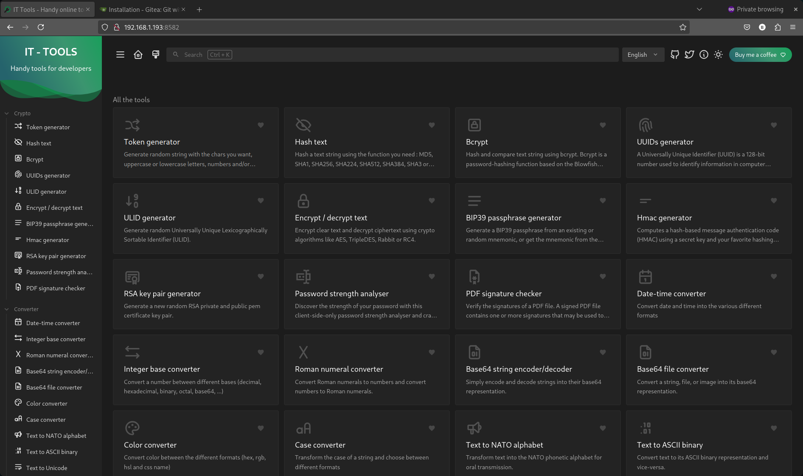
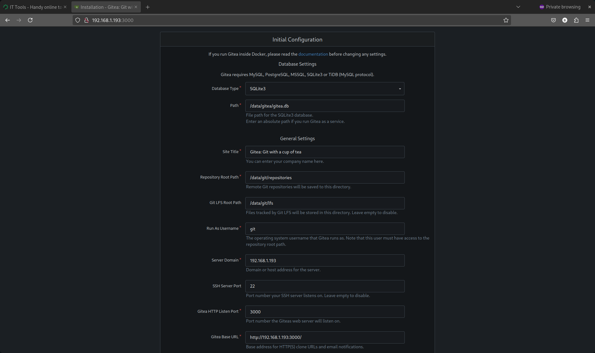

# Ansible Playbooks for Proxmox and LXCs - Part 4

I like to run stuff inside Docker (I know, some people have a visceral aversion to this. Whatever.), so in addition to the basic setup and tweaks, the most common thing I'm doing when I spin up a VM is [going through the Docker setup process](https://docs.docker.com/engine/install/debian/). I've done this so many times I think I could install Docker blindfolded at this point—so let's automate things.

## Jeff Geerling's Docker Role

There's a cool YouTuber and blogger named [Jeff Geerling](https://www.jeffgeerling.com/) who has already put together a [a great role for installing Docker](https://github.com/geerlingguy/ansible-role-docker), so no need to reinvent the wheel (maybe I'm already doing that... honestly, I couldn't find a good role for Proxmox).

### Install the Role

I put this in my `bootstrap.yml`, but you can just as easily install it manually.

```bash
ansible-galaxy role install geerlingguy.docker
```

Here's my full `bootstrap.yml` of dependencies. I also added a task to make sure the community modules are up-to-date (I talked about this in part 2 the Ansible/Proxmox series).

```yaml
---
- name: Bootstrap dependencies
  hosts: localhost
  connection: local
  gather_facts: no
  tasks:
    - name: Install required Python libraries
      ansible.builtin.pip:
        name:
          - proxmoxer
          - requests
          - passlib
        state: present

    - name: Upgrade community.general collection
      command: ansible-galaxy collection install community.general --upgrade
      changed_when: false

    - name: Install required Ansible Galaxy role (geerlingguy.docker)
      command: ansible-galaxy role install geerlingguy.docker
      changed_when: false
```

## Add Another Group

I don't want the Docker installation to be coupled to the `install_extras` flag, so I'm creating a separate group for this setup task.

```yaml
- name: Add container to dynamic inventory for docker setup
  add_host:
    name: "lxc_{{ container.vmid }}_user"
    groups: proxmox_containers_docker
    ansible_host: "{{ container_ip }}"
    ansible_connection: ssh
    ansible_user: "{{ container.username | default('demo') }}"
    ansible_ssh_private_key_file: "{{ container.private_key }}"
    ansible_python_interpreter: /usr/bin/python3
    path_to_compose_files: "{{ role_path }}/files/compose_files"
    container: "{{ container }}"
    ansible_become: yes
    ansible_become_method: sudo
  when: container.install_docker | default(false) and container.initial_setup | default(false)
```

Adding the `path_to_compose_files` value ended up being important for remembering the context of the role down the road. It was a big headache when I was trying to install containers within the LXC. That’s when I realized I should probably rethink the structure of this project (foreshadowing).

## Add the Features Tag for LXC Creation

We need to allow the `create.yml` script to accept the `features` tag as an LXC parameter. LXC's need to have `nesting` enabled for Docker to run properly inside them (otherwise, it will fail when trying to access `/proc` due to permissions).

```yaml
- name: Create LXC container on Proxmox
  community.general.proxmox:
    api_host: "{{ proxmox_api_host }}"
    api_user: "{{ proxmox_api_user }}"
    api_token_id: "{{ proxmox_api_id }}"
    api_token_secret: "{{ proxmox_api_secret }}"
    node: "{{ proxmox_node }}"
    vmid: "{{ container.vmid }}"
    hostname: "{{ container.hostname }}"
    ostemplate: "{{ container.ostemplate }}"
    storage: "{{ container.storage }}"
    cores: "{{ container.cores }}"
    memory: "{{ container.memory }}"
    swap: "{{ container.swap }}"
    disk: "{{ container.disk }}"
    netif: '{"net0": "{{ container.net }}"}'
    password: "{{ container.password | default(omit) }}"
    onboot: "{{ container.onboot | default(false) }}"
    startup: "{{ container.startup | default(omit) }}"
    pubkey: "{{ lookup('file', container.pubkey_file) | default(omit) }}"
    features: "{{ container.features | default(omit) }}" # Add this
    state: present
```

In your `lxcs.yml` file, add `features: "nesting=1"` to the parameters that you pass when setting the LXC state to present.

## Adding a Docker Install Play

Add a play to your playbook with the appropriate flags—refer to Jeff's documentation on GitHub for guidance on this. Here's what I used:

```yaml
- name: Run docker setup on provisioned containers
  hosts: proxmox_containers_docker
  gather_facts: yes
  roles:
    - role: geerlingguy.docker
      vars:
        docker_edition: 'ce'
        docker_service_state: started
        docker_service_enabled: true
        docker_packages:
          - "docker-{{ docker_edition }}"
          - "docker-{{ docker_edition }}-cli"
          - "docker-{{ docker_edition }}-rootless-extras"
        docker_packages_state: present
        docker_install_compose_plugin: true
        docker_compose_package: docker-compose-plugin
        docker_compose_package_state: present
        docker_users:
          - "{{ container.username | default('demo') }}"
```

Run your playbook and check the Docker and Docker Compose versions from within the VM to see if it installed correctly:

```bash
demo@test06:~$ docker --version
Docker version 27.5.1, build 9f9e405
demo@test06:~$ docker compose version
Docker Compose version v2.32.4
```

It's truly that simple. Thanks, Jeff.

## Creating Some Container Templates

I want to automatically spin up some Docker containers using Compose files when I create my LXCs. I created a new directory in `files` called `compose_files`—this is where I'll keep my Docker Compose manifests and their Jinja2 templates for the environments. For example:

### IT Tools

This container has a suite of useful tools for people who do IT stuff for a living and don't want to use public sites (like `jsonformatter.org`, for example) that might be scraping your data—and filling your screen with ungodly amounts of ads.

#### `docker-compose.yml`

```yaml
---
services:
  it-tools:
    image: 'corentinth/it-tools:latest'
    env_file:
      - .env
    ports:
      - '${PORT}:80'
    restart: unless-stopped
    container_name: it-tools
```

#### `.env`

```bash
# Environment variables for the IT Tools container
PORT={{ item.value.port }}
```

### Gitea

A useful self-hosted git repo.

#### `docker-compose.yml`

```yaml
---
services:
  gitea:
    image: 'gitea/gitea:latest'
    restart: unless-stopped
    volumes:
      - '/mnt/md/data/gitea:/data'
      - '/etc/timezone:/etc/timezone:ro'
      - '/etc/localtime:/etc/localtime:ro'
    env_file:
      - .env
    ports:
      - '${PORT_HTTP}:3000'
      - '${PORT_SSH}:22'
```

#### `.env`

```bash
# Environment variables for Gitea
PORT_HTTP={{ item.value.port_http }}
PORT_SSH={{ item.value.port_ssh }}
```

## Adding a Container Setup Script

Let's add a new script to `roles/proxmox_lxc/tasks/compose_setup.yml`.

```yaml
---
- name: Create docker directory for each container
  file:
    path: "/home/{{ container.username | default('demo') }}/docker/{{ item.key }}"
    state: directory
    mode: '0755'
  loop: "{{ container.docker_containers | dict2items }}"
  loop_control:
    label: "{{ item.key }}"
  become: yes
  become_user: "{{ container.username | default('demo') }}"

- name: Copy docker compose file for container "{{ item.key }}"
  copy:
    src: "{{ path_to_compose_files }}/{{ item.key }}.yml"
    dest: "/home/{{ container.username | default('demo') }}/docker/{{ item.key }}/docker-compose.yml"
    mode: '0644'
  loop: "{{ container.docker_containers | dict2items }}"
  loop_control:
    label: "{{ item.key }}"
  become: yes
  become_user: "{{ container.username | default('demo') }}"

- name: Template .env file for container "{{ item.key }}"
  template:
    src: "{{ path_to_compose_files }}/{{ item.key }}.env.j2"
    dest: "/home/{{ container.username | default('demo') }}/docker/{{ item.key }}/.env"
    mode: '0644'
  loop: "{{ container.docker_containers | dict2items }}"
  loop_control:
    label: "{{ item.key }}"
  become: yes
  become_user: "{{ container.username | default('demo') }}"

- name: Run docker compose up -d in container directory for "{{ item.key }}"
  shell: "docker compose up -d"
  args:
    chdir: "/home/{{ container.username | default('demo') }}/docker/{{ item.key }}"
  loop: "{{ container.docker_containers | dict2items }}"
  loop_control:
    label: "{{ item.key }}"
  become: yes
  become_user: "{{ container.username | default('demo') }}"
```

This will:

1. Iterate through a dictionary called `docker_containers` in your LXC manifest.
2. Create a directory in `~/docker/` for each container.
3. Copy a `docker-compose.yml` and `.env` file into that directory.
4. Automatically pull and start the container using Docker Compose.

So, your LXC manifest should include a `docker_containers` parameter like this:

```yaml
lxcs:
  - vmid: 115
    hostname: test06
    username: demo
    user_password: "demo123"
    pubkey_file: "~/.ssh/nuc_rsa.pub"
    private_key: "~/.ssh/nuc_rsa"
    state: started
    wait_for_status: true
    get_ip: true
    initial_setup: true
    install_extras: true
    install_docker: true
    # The part below is new
    docker_containers:
      it-tools:
        port: 8582
      gitea:
        port_http: 3000
        port_ssh: 222
```

## Updating and Running the Playbook

Finally, add the following step to your playbook.

```yaml
- name: Run docker container setup on provisioned containers
  hosts: proxmox_containers_docker
  gather_facts: yes
  tasks:
    - include_tasks: ../roles/proxmox_lxc/tasks/compose_setup.yml
```

Now run the playbook, and once it's done, enter your container's IP into a web browser with the `:3000` and `:8582` ports.





## Closing

It was at this point that I realized, "Hey, this works, but it is absolute nonsense." By that, I mean things up to this point have been structured completely wrong. I spent an entire day trying to figure out where I went wrong—reading and watching tutorials. There is a core tenet of Ansible roles that frankly eluded me until now:

**Do one thing and do it well.**

So, dear reader, I know I said this would be my last post on this topic, but I'm going to [guide you directly to part 5]() where we will work on _completely refactoring_ this mess and submitting it to Ansible Galaxy.