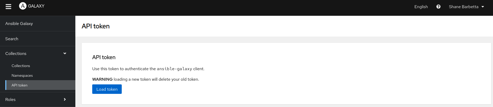

# Ansible Playbooks for Proxmox and LXCs - Part 5

This role is a complete disappointment and defies Ansible best practices. Philosophically speaking, a role should focus on doing a single task well and not be all over the place. Therefore, I'm going to split up the functionality we've created thus far into separate roles and move some things around.

## Adding a Couple Things to the Vault

All properties pertaining specifically to the Proxmox instance itself (not container settings) should be stored in the vault. Most of our Proxmox-related values are already in the vault, but I'd previously put the `proxmox_api_host` and `proxmox_node` in my role defaults. I'm simply moving those to the vault. Edit your vault with the following:

```bash
ansible-vault edit vars/proxmox-vault.yml --ask-vault-pass
```

```yaml
proxmox_api_host: "proxmox.example.com"
proxmox_api_user: "root@pam"
proxmox_node: "pve"
proxmox_api_id: "ansible"
proxmox_api_secret: "your_secret"
```

## Creating a `proxmox_provision` Role

This role will specifically handle creating and starting up the LXCs. Initialize a new role in the roles directory:

```bash
ansible-galaxy init roles/proxmox_provision
```

I want to add some important logic here—when the container is already provisioned and running, don't attempt to wait and start the container. This was a massive pain when I was testing, since Ansible will fail if the container is already started, and I had to keep stopping the container when testing the script. Since the community module for Proxmox does not appear to have a way to retrieve info for an LXC, we have to write another script using the `proxmoxer` module. It's not much different from the one we wrote to wait for the LXC to finish spinning up.

```python
#!/usr/bin/env python3
import sys
import argparse
from proxmoxer import ProxmoxAPI

parser = argparse.ArgumentParser(
    description="Check if a Proxmox LXC container is running."
)
parser.add_argument("--host", required=True, help="Proxmox API host")
parser.add_argument("--user", required=True, help="Proxmox API user")
parser.add_argument("--token_name", required=True, help="Proxmox API token name")
parser.add_argument("--token_value", required=True, help="Proxmox API token secret")
parser.add_argument("--node", required=True, help="Proxmox node name")
parser.add_argument("--vmid", type=int, required=True, help="VMID of the container")
args = parser.parse_args()

proxmox = ProxmoxAPI(
    args.host,
    user=args.user,
    token_name=args.token_name,
    token_value=args.token_value,
    verify_ssl=False,
)

try:
    status_info = proxmox.nodes(args.node).lxc(args.vmid).status.current.get()
    current_status = status_info.get('status')
    if current_status == 'running':
        print(f"Container {args.vmid} is running.")
        sys.exit(0)
    else:
        print(f"Container {args.vmid} exists but is not running (status: {current_status}).")
        sys.exit(1)
except Exception as e:
    print(f"Error retrieving container status: {e}", file=sys.stderr)
    sys.exit(1)
```

Save that as `check_container_running.py` in `proxmox_provision/files` and make it executable (`chmod +x`). Also move the existing `wait_for_container.py` file over. Then add the following files to your `tasks` directory in the new role. 

### `precheck.yml`

This will set a boolean if the container is already running.

```yaml
---
- name: Check if the container is already running
  command: >
    {{ role_path }}/files/check_container_running.py
    --host "{{ proxmox_api_host }}"
    --user "{{ proxmox_api_user }}"
    --token_name "{{ proxmox_api_id }}"
    --token_value "{{ proxmox_api_secret }}"
    --node "{{ proxmox_node }}"
    --vmid "{{ container.vmid }}"
  delegate_to: localhost
  register: container_status
  ignore_errors: yes

- name: Set fact whether container is running
  set_fact:
    container_already_running: "{{ container_status.rc == 0 }}"
```

### `create.yml`

```yaml
---
- name: Create LXC container on Proxmox
  community.general.proxmox:
    api_host: "{{ proxmox_api_host }}"
    api_user: "{{ proxmox_api_user }}"
    api_token_id: "{{ proxmox_api_id }}"
    api_token_secret: "{{ proxmox_api_secret }}"
    node: "{{ proxmox_node }}"
    vmid: "{{ container.vmid }}"
    hostname: "{{ container.hostname }}"
    ostemplate: "{{ container.ostemplate }}"
    storage: "{{ container.storage }}"
    cores: "{{ container.cores }}"
    memory: "{{ container.memory }}"
    swap: "{{ container.swap }}"
    disk: "{{ container.disk }}"
    netif: '{"net0": "{{ container.net }}"}'
    password: "{{ container.password | default(omit) }}"
    onboot: "{{ container.onboot | default(false) }}"
    startup: "{{ container.startup | default(omit) }}"
    pubkey: "{{ lookup('file', container.pubkey_file) | default(omit) }}"
    features: "{{ container.features | default(omit) }}"
    state: present
```

### `wait.yml`

Note that if the container is already running this is skipped.

```yaml
---
- name: Wait for container to be registered with expected hostname
  command: >
    {{ role_path }}/files/wait_for_container.py
    --host "{{ proxmox_api_host }}"
    --user "{{ proxmox_api_user }}"
    --token_name "{{ proxmox_api_id }}"
    --token_value "{{ proxmox_api_secret }}"
    --node "{{ proxmox_node }}"
    --vmid "{{ container.vmid }}"
    --expected-hostname "{{ container.hostname }}"
    --retries 10
    --delay 3
  delegate_to: localhost
  register: container_status
  until: container_status.rc == 0
  retries: 10
  delay: 3
  when: not (container_already_running | default(false))
```

### `start.yml`

```yaml
---
- name: Ensure LXC container is started on Proxmox
  community.general.proxmox:
    api_host: "{{ proxmox_api_host }}"
    api_user: "{{ proxmox_api_user }}"
    api_token_id: "{{ proxmox_api_id }}"
    api_token_secret: "{{ proxmox_api_secret }}"
    node: "{{ proxmox_node }}"
    vmid: "{{ container.vmid }}"
    state: started
  register: start_result
  failed_when: start_result.failed and ('already running' not in start_result.msg)
  when: not (container_already_running | default(false))
```

### `main.yml`

This file already exists by default - modify it with the following:

```yaml
---
# Pre-check: Determine if container is already running
- include_tasks: precheck.yml

# Run the creation task
- include_tasks: create.yml

# Wait until the container is properly registered
- include_tasks: wait.yml

# Start the container
- include_tasks: start.yml
```

## Creating a `container_inventory` Role

We will have a separate role strictly for iterating through all of the containers we've created, retrieving their IPs, and creating groups of dynamic hosts for further tasks.

Copy the `get_container_ip.py` script to this container's `files` directory, then in `tasks` create the following.

### `inventory.py`

This will get the IP of your containers using the script, then build your groups that will later be enumerated over for other tasks. Note that some of the container parameters have changed, since I've nested the non-Proxmox-related LXC settings inside a `config` dictionary.

```yaml
---
- name: Retrieve container IP via DHCP using proxmoxer
  command: >
    {{ role_path }}/files/get_container_ip.py
    --host "{{ proxmox_api_host }}"
    --user "{{ proxmox_api_user }}"
    --token_name "{{ proxmox_api_id }}"
    --token_value "{{ proxmox_api_secret }}"
    --node "{{ proxmox_node }}"
    --vmid "{{ container.vmid }}"
    --retries 10
    --delay 3
  register: ip_result
  changed_when: false

- name: Set container IP fact
  set_fact:
    container_ip: "{{ ip_result.stdout }}"

- name: Debug - Show container IP
  debug:
    msg: "Container IP is: {{ container_ip }}"

- name: Add container to dynamic inventory (as root)
  add_host:
    name: "lxc_{{ container.vmid }}"
    groups: proxmox_containers
    ansible_host: "{{ container_ip }}"
    ansible_connection: ssh
    ansible_user: root
    ansible_ssh_private_key_file: "{{ container.config.private_key }}"
    ansible_python_interpreter: /usr/bin/python3
    container: "{{ container }}"
  when: container.config.initial_setup | default(false)

- name: Add container to dynamic inventory (non-root for extras)
  add_host:
    name: "lxc_{{ container.vmid }}_user"
    groups: proxmox_containers_extras
    ansible_host: "{{ container_ip }}"
    ansible_connection: ssh
    ansible_user: "{{ container.config.username }}"
    ansible_ssh_private_key_file: "{{ container.config.private_key }}"
    ansible_python_interpreter: /usr/bin/python3
    container: "{{ container }}"
    ansible_become: yes
    ansible_become_method: sudo
  when: container.config.install_extras | default(false) and container.config.initial_setup | default(false)

- name: Add container to dynamic inventory for docker setup
  add_host:
    name: "lxc_{{ container.vmid }}_user"
    groups: proxmox_containers_docker
    ansible_host: "{{ container_ip }}"
    ansible_connection: ssh
    ansible_user: "{{ container.config.username }}"
    ansible_ssh_private_key_file: "{{ container.config.private_key }}"
    ansible_python_interpreter: /usr/bin/python3
    path_to_compose_files: "{{ role_path }}/files/compose_files"
    container: "{{ container }}"
    ansible_become: yes
    ansible_become_method: sudo
  when: container.config.install_docker | default(false) and container.config.initial_setup | default(false)
```

The `main.yml` is simply.

```yaml
---
# Retrieve the container IP and create a dynamic inventory
- include_tasks: inventory.yml
```

## Creating a `container_setup` Role

This role will handle the initial setup. Within the role, we've integrated the check that attempts to log in as root and then ends the play if it's denied (due to the root login being disabled). Following that, it continues with the initial setup.

### `connection_check.yml`

```yaml
---
- name: Wait for connection to container
  wait_for_connection:
    timeout: 15
  register: root_conn_test
  ignore_errors: yes

# - name: Debug - Show connection check result
#   debug:
#     var: root_conn_test

- name: End play if connection check fails
  meta: end_play
  when: root_conn_test.failed
```

### `setup.yml`

```yaml
---
- name: Update apt cache and upgrade packages
  apt:
    update_cache: yes
    upgrade: dist
  become: yes

- name: Ensure sudo is installed
  apt:
    name: sudo
    state: present
  become: yes

- name: Create non-root user
  user:
    name: "{{ container.config.username }}"
    shell: /bin/bash
    create_home: yes
    password: "{{ container.config.user_password | password_hash('sha512') }}"
  become: yes

- name: Add user to sudo group
  user:
    name: "{{ container.config.username }}"
    groups: sudo
    append: yes
  become: yes

- name: Allow user passwordless sudo
  copy:
    dest: "/etc/sudoers.d/{{ container.config.username }}"
    content: "{{ container.config.username }} ALL=(ALL) NOPASSWD: ALL\n"
    owner: root
    group: root
    mode: '0440'
  become: yes

- name: Copy SSH public key to authorized_keys
  authorized_key:
    user: "{{ container.config.username }}"
    state: present
    key: "{{ lookup('file', container.pubkey_file) }}"
  become: yes

- name: Ensure PubkeyAuthentication is enabled in sshd_config
  lineinfile:
    path: /etc/ssh/sshd_config
    regexp: '^#?PubkeyAuthentication'
    line: 'PubkeyAuthentication yes'
  become: yes

- name: Ensure PasswordAuthentication is disabled in sshd_config
  lineinfile:
    path: /etc/ssh/sshd_config
    regexp: '^#?PasswordAuthentication'
    line: 'PasswordAuthentication no'
  become: yes

- name: Ensure PermitRootLogin is disabled in sshd_config
  lineinfile:
    path: /etc/ssh/sshd_config
    regexp: '^#?PermitRootLogin'
    line: 'PermitRootLogin no'
  become: yes

- name: Restart SSH service
  service:
    name: ssh
    state: restarted
  become: yes
```

## Creating a `container_extras` Role

This role handles all the extra software installs and tweaks that occur as a non-root user. It can easily be extended to include more features as needed.

### `extras.yml`

```yaml
---
- name: Update apt cache and install extra packages
  apt:
    update_cache: yes
    name:
      - kitty-terminfo
      - tmux
      - htop
      - curl
      - jq
      - fzf
      - neofetch
    state: present
  become: yes

- name: Backup update-motd.d and create new directory
  shell: "mv /etc/update-motd.d /etc/update-motd.d.bak && mkdir /etc/update-motd.d"
  become: yes

- name: Truncate /etc/motd
  shell: "truncate -s 0 /etc/motd"
  become: yes

- name: Create a .hushlogin file 
  shell: "touch ~/.hushlogin && chmod 644 ~/.hushlogin"
  become: yes

- name: Append neofetch block to .bashrc
  blockinfile:
    path: "/home/{{ container.config.username }}/.bashrc"
    marker: "# {mark} NEOFETCH BLOCK"
    block: |
      # Run neofetch only in interactive shells
      case $- in
          *i*)
              echo " "
              neofetch
              echo " "
              ;;
          *) ;;  # Do nothing for non-interactive shells
      esac
  become: yes
  become_user: "{{ container.config.username }}"
```

## Creating a `docker_compose` Role

This role handles the creation of Docker containers after we've spun up our LXC, configured it, and installed Docker using Jeff Geerling's Docker setup role. Copy over all the files from the `proxmox_lxc` role's `files/compose_files`, then add the following modified task.

### `compose_setup.yml`

```yaml
---
- name: Create docker directory for each container
  file:
    path: "/home/{{ container.config.username }}/docker/{{ item.key }}"
    state: directory
    mode: '0755'
  loop: "{{ container.config.docker_containers | default({}) | dict2items }}"
  loop_control:
    label: "{{ item.key }}"
  become: yes
  become_user: "{{ container.config.username }}"

- name: Copy docker compose file for container "{{ item.key }}"
  copy:
    src: "{{ role_path }}/files/compose_files/{{ item.key }}.yml"
    dest: "/home/{{ container.config.username }}/docker/{{ item.key }}/docker-compose.yml"
    mode: '0644'
  loop: "{{ container.config.docker_containers | default({}) | dict2items }}"
  loop_control:
    label: "{{ item.key }}"
  become: yes
  become_user: "{{ container.config.username }}"

- name: Template .env file for container "{{ item.key }}"
  template:
    src: "{{ role_path }}/files/compose_files/{{ item.key }}.env.j2"
    dest: "/home/{{ container.config.username }}/docker/{{ item.key }}/.env"
    mode: '0644'
  loop: "{{ container.config.docker_containers | default({}) | dict2items }}"
  loop_control:
    label: "{{ item.key }}"
  become: yes
  become_user: "{{ container.config.username }}"

- name: Run docker compose up -d in container directory for "{{ item.key }}"
  shell: "docker compose up -d"
  args:
    chdir: "/home/{{ container.config.username }}/docker/{{ item.key }}"
  loop: "{{ container.config.docker_containers | default({}) | dict2items }}"
  loop_control:
    label: "{{ item.key }}"
  become: yes
  become_user: "{{ container.config.username }}"
```

## Final Playbook & LXC Manifest

Your playbook will now look like this:

```yaml
---
- name: Provision Proxmox LXC containers
  hosts: localhost
  connection: local
  gather_facts: no
  vars_files:
    - ../vars/proxmox-vault.yml
    - ../vars/lxcs.yml
  tasks:
    - name: Run proxmox_provision role for each container
      include_role:
        name: proxmox_provision
      vars:
        container: "{{ item }}"
      loop: "{{ lxcs }}"

- name: Populate dynamic inventory with container hosts
  hosts: localhost
  connection: local
  gather_facts: no
  vars_files:
    - ../vars/proxmox-vault.yml
    - ../vars/lxcs.yml
  tasks:
    - name: Run container_setup inventory tasks for each container
      include_role:
        name: container_inventory
        tasks_from: inventory.yml
      vars:
        container: "{{ item }}"
      loop: "{{ lxcs }}"

- name: Run initial container setup
  hosts: proxmox_containers
  gather_facts: no
  become: yes
  roles: 
    - role: container_setup

- name: Run extras configuration on containers
  hosts: proxmox_containers_extras
  gather_facts: yes
  become: yes
  roles: 
    - role: container_extras

- name: Run docker setup on provisioned containers
  hosts: proxmox_containers_docker
  gather_facts: yes
  roles:
    - role: geerlingguy.docker
      vars:
        docker_edition: 'ce'
        docker_service_state: started
        docker_service_enabled: true
        docker_packages:
          - "docker-{{ docker_edition }}"
          - "docker-{{ docker_edition }}-cli"
          - "docker-{{ docker_edition }}-rootless-extras"
        docker_packages_state: present
        docker_install_compose_plugin: true
        docker_compose_package: docker-compose-plugin
        docker_compose_package_state: present
        docker_users:
          - "{{ container.config.username }}"

- name: Run docker container setup on provisioned containers
  hosts: proxmox_containers_docker
  gather_facts: yes
  become: yes
  roles: 
    - role: docker_compose
```

The simplified `lxcs.yml` file will look something like this:

```yaml
lxcs:
  - vmid: 125
    hostname: testing
    ostemplate: "local:vztmpl/debian-12-standard_12.7-1_amd64.tar.zst"
    storage: "local-lvm"
    cores: 1
    memory: 1024
    swap: 512
    disk: "local-lvm:25"
    net: "name=eth0,bridge=vmbr0,ip=dhcp"
    password: "containerpassword"
    onboot: true
    pubkey_file: "~/.ssh/id_rsa.pub"
    features: "nesting=1"
    # Additional configuration
    config:
      username: demo
      user_password: "demo123"
      private_key: "~/.ssh/id_rsa"
      wait_for_status: true
      initial_setup: true
      install_extras: true
      install_docker: true
      docker_containers:
        it-tools:
          port: 8582
        gitea:
          port_http: 3000
          port_ssh: 222
```

## Putting Everything in a Collection

Since these are all components of a unified workflow, rather than submitting them to Ansible Galaxy as disparate roles, Ansible supports bundling roles together in "collections." These work a bit like functions inside a Python package in the way they're invoked. The structure of my Ansible collection is like this:

```
ansible_collections/
└── sbarbett/
    └── proxmox_management/
        ├── galaxy.yml
        ├── README.md
        ├── docs/
        ├── meta/
        |   ├── runtime.yml
        └── roles/
            ├── proxmox_provision/
            ├── container_inventory/
            ├── container_setup/
            ├── container_extras/
            └── docker_compose/
```

In each of my roles I've added basic `README.md` files and meta files — I won’t get into the details since Ansible already provides a fairly good template. The `runtime.yml` file is required and, in my case, just contains the line:

```yaml
requires_ansible: ">=2.9"
```

_Note:_ You can use `ansible-galaxy collection init` to create scaffold for a collection, but I didn't.

The `galaxy.yml` file contains all the necessary metadata for your collection.

```yaml
namespace: sbarbett
name: proxmox_management
version: "1.0.1"
readme: README.md
authors:
  - Shane Barbetta
description: >
  A collection for managing Proxmox LXC containers (provisioning, configuration, and Docker deployment).
license: MIT
tags:
  - proxmox
  - lxc
  - docker
dependencies:
  community.general: ">=6.0.0"
repository: https://github.com/sbarbett/proxmox-ansible
```

This is a minimal collection manifest. Note that the `repository` link is required (one of my first attempts to submit the collection failed because I forgot to nclude this).

### Building the Collection

Run the following command from the root directory of your collection:

```bash
ansible-galaxy collection build
```

This will produce a gzipped tarball with the name of your package and version from your `galaxy.yml`, like this: `sbarbett-proxmox_management-1.0.0.tar.gz`. For local use, you can install your collection using:

```bash
ansible-galaxy collection install namespace-package_name-1.x.x.tar.gz 
```

### Submitting to Ansible Galaxy

Submit your collection to Ansible Galaxy using the following command.:

```bash
ansible-galaxy collection publish namespace-package_name-1.x.x.tar.gz --api-key your_api_key
```

You can get your API key from the Ansible Galaxy website (obviously, you must register an account first). The option is (fairly prominently) on the left-hand side under the **Collections** menu.



## Conclusion

Tools like Ansible and Terraform have become ubiquitous in the DevOps space and are probably considered a _hard requirement_ for any DevOps role at this point. My experience learning Ansible was frustrating at times—it's rather insistent that you adopt its paradigms, which can be quite different from how I'd approach similar challenges with basic Python or shell scripts. Still, it's an extremely useful tool. Watching a playbook roll across your terminal and accomplish a bunch of mundane tasks that would have otherwise taken you an hour is, well, a bit... magical? I dunno. I hope you enjoyed learning with me. I'm sure I'll talk about this more in the future, but for now, it's time for a change in scenery.