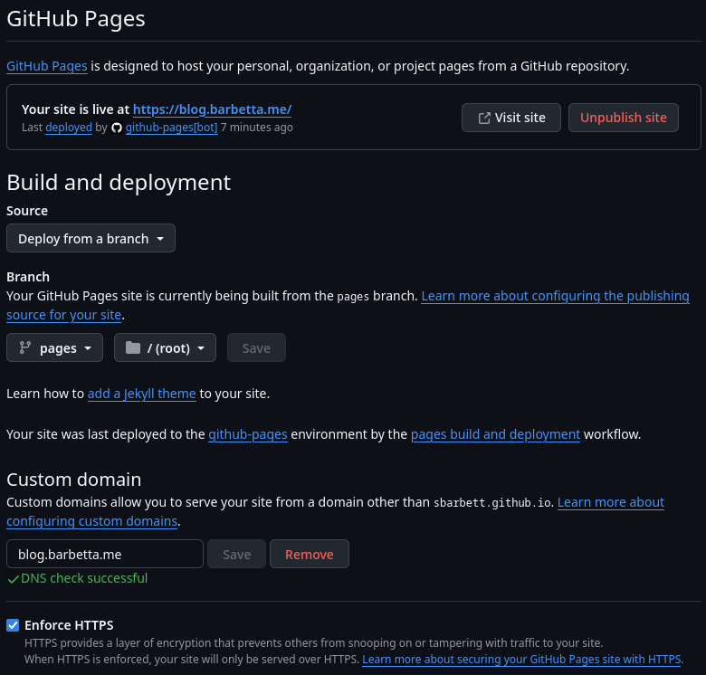

# Relocating My Blog to GitHub Pages

I am a man who is easily distracted (clearly, it's been six months since I last posted here). I like to experiment with things, and creating this blog was largely an experiment with Hugo and Docker. Here are a couple of notes about me:

1. I dislike rich text editors
2. I am not fond of HTML or CSS
3. I like writing in Markdown; I think it's efficient
4. I like Git
5. I like things that are free

If I was going to start a blog and update it with any regularity, I needed it to be dead simple. I wanted to write in Markdown, commit that Markdown to a repository, and have it magically turned into a webpage—which is easier said than done, it seems. This is how I came across Hugo.

## Hugo

[Hugo](https://github.com/gohugoio/hugo) is a framework written in Go that takes Markdown files and turns them into a static site. There’s a [litany of themes](https://themes.gohugo.io/) you can add as **Hugo Modules** (built on Go modules) by importing them in your config.

The Hugo config file defines site-wide settings. Posts use front matter. For example (YAML shown here—Hugo also supports TOML and JSON):

```yaml
---
title: "Relocating My Blog to GitHub Pages"
date: 2025-08-27
draft: false
tags:
  - hugo
  - blog
  - github
  - pages
showFullContent: false
description: "A simple Hugo + GitHub Pages setup: build on tags, deploy to a pages branch, point a custom domain."
---
```

Then you simply run `hugo` and it outputs the site to the `public/` directory by default (you can change this with `publishDir`).

Hugo has plenty of features that make it suitable for more sophisticated projects, but those were outside the scope of my needs.

## Hosting the Static Site

In the initial iteration of this project, I ran Hugo inside a Docker container and used an Nginx container to serve the `public/` folder. Here's the compose file I was using:

```yaml
name: blog

services:
  hugo:
    image: hugomods/hugo:exts-non-root
    command: hugo --cleanDestinationDir --destination /usr/share/nginx/html --baseURL https://blog.barbetta.me
    volumes:
      - .:/src
      - ./public:/usr/share/nginx/html
    restart: unless-stopped
    networks:
      proxy_network:
        ipv4_address: 192.168.100.3  # Static IP for Hugo

  nginx:
    image: nginx:latest
    depends_on:
      - hugo
    networks:
      proxy_network:
        ipv4_address: 192.168.100.4  # Static IP for Blog Nginx
    volumes:
      - ./public:/usr/share/nginx/html:ro
      - ./nginx.conf:/etc/nginx/conf.d/default.conf:ro
    ports:
      - 1313:80
    restart: unless-stopped

networks:
  proxy_network:
    external: true  # Use the pre-defined network from NPM
```

With this approach, I ran the container on a local VPS. I used a Gitea instance to push the Markdown files, although the process was still fairly manual:

1. Write Markdown files on my laptop
2. Push to Gitea
3. SSH into VPS
4. Pull from Gitea
5. Restart the container

Mostly, this was fine, but I saw room for improvement. It could be more automated, and I didn't want to rely on a VPS. An S3 bucket could just as easily serve a static site, or...

## GitHub Actions & Pages

Lately I’ve been exploring all the potential of GitHub Pages. This is a really simple (and free) way to put up a basic static page *(free for public repos; private repos require a paid plan)*. I [wrote a simple workflow](https://raw.githubusercontent.com/sbarbett/reticulating-splines/refs/heads/main/.github/workflows/hugo.yml) that, on release, runs Hugo on the repo, then commits the build to a separate branch called `pages`. GitHub Pages can be served from either the root or `/docs` folder of any branch—including a dedicated one.

The [other workflow](https://raw.githubusercontent.com/sbarbett/reticulating-splines/refs/heads/main/.github/workflows/release-from-tag.yml) is one I’ve used on other projects—it runs whenever a tag is pushed to the repository. So publishing a new post looks something like this:

1. Add the new Markdown file to `content/posts/`
2. Update the `CHANGELOG.md` with a summary
3. Push the content and a new tag to the repository

This will kick off the release process: a release is generated from the CHANGELOG, the CHANGELOG is updated, and then the release workflow is initiated.

## Custom Domains

Setting up a custom domain is straightforward —

1. Go to your **profile** settings → **Pages** and add your domain (this step is for verification). GitHub will prompt you to add a TXT record for DCV. Keep that TXT record in DNS so the domain stays verified.
2. In your **repository** settings → **Pages**, set the custom domain for the specific site. If you’re publishing from a branch, GitHub will create (or expect) a `CNAME` file at the root of the publishing source.
3. Add your DNS records:

   * For a **subdomain** (e.g., `blog.example.com`), create a **CNAME** pointing to `<user>.github.io` (not the repo name).
   * For an **apex** (e.g., `example.com`), use **A/AAAA** (or ALIAS/ANAME) to GitHub Pages—**not** a CNAME (those aren't permitted at the root, which we all know of course).
4. In my case, I created a CNAME from `blog.barbetta.me` to `sbarbett.github.io`.

   * **If you’re using Cloudflare, TURN OFF THE PROXY (DNS-only) while GitHub provisions HTTPS.** With the proxy on, GitHub can’t issue its certificate; you can re-enable the proxy after provisioning if you want (although, I can't say whether this will interfere with certificate renewal... I left it off).
5. My `hugo.yml` workflow also creates a `CNAME` file in the `pages` branch—this signals the custom domain when publishing **from a branch**. Note: if you use the **Pages Actions** deploy (artifact + `actions/deploy-pages`), a `CNAME` file is ignored and not required.



## Summary

GitHub Actions can be fickle at times, but all in all, getting this up and running wasn’t too difficult. If you’re interested in setting up a blog this way and have questions, feel free to reach out through [my contact form](https://shane.barbetta.me). Something I may explore next is building a custom Hugo theme.