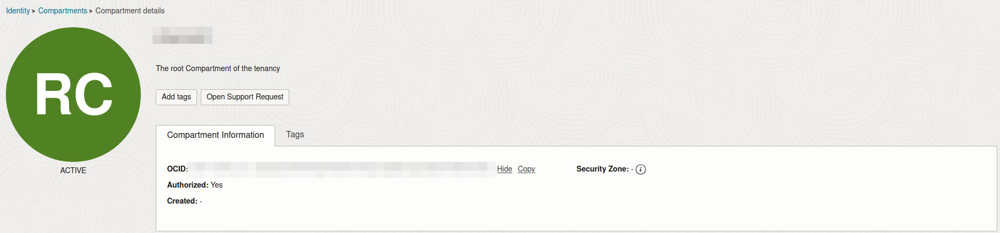

# Deploying an OCI Pi-hole with Terraform

The other day, I wrote about deploying a Pi-hole on an Oracle Cloud VM alongside Unbound and WireGuard. In that post, I explained how to set everything up manually through the web interface and CLI. This time, I wanted to automate the deployment using a shell script and OCI's Terraform module.

## Terraform

Terraform is an infrastructure-as-code tool that lets you define and provision infrastructure through configuration files. Instead of manually setting up resources, you can describe them in a script, and Terraform will handle the provisioning.

To use it, you'll need to install the `terraform` client. On Arch Linux:

```bash
pacman -S terraform
# ...or use your pacman wrapper, like paru
```

I haven't installed Terraform on macOS or Windows myself, but you can find installation instructions in [Hashicorp's documentation](https://developer.hashicorp.com/terraform/tutorials/aws-get-started/install-cli).


## Installing the OCI CLI

The Oracle Cloud Infrastructure (OCI) CLI isn't strictly required for this setup, but it can be helpful. You can find installation instructions in  [Oracle's docs](https://docs.oracle.com/en-us/iaas/Content/API/SDKDocs/cliinstall.htm).

On Arch, install it with:

```bash
pacman -S oci-cli
```

Once installed, you can run the guided configuration setup:

```bash
oci setup config
```

## Manual Config Setup

I wasn't initially aware of the CLI’s guided setup, so I configured everything manually. If you'd prefer to do the same, follow these steps:

1. In the OCI web interface, go to your profile and look for the **API Keys** section.

    

2. Click **Add API Key**. You'll be prompted to download your key files—make sure to download at least the private key.

    

3. Move the private key to your `~/.ssh` directory, rename it to something like `oci-api.pem`, and adjust its permissions:

    ```bash
    mv path/to/downloaded-key ~/.ssh/oci-api.pem
    chmod 600 ~/.ssh/oci-api.pem
    ```

4. After clicking **Add**, you'll be presented with a configuration file.

    

5. Save this configuration file as `~/.oci/config` and update the key file path inside it to match your private key location:

    ```bash
    key_file=~/.ssh/oci-api.pem
    ```

### Testing

To verify that the OCI CLI is working correctly, run a few test commands.

```bash
oci iam availability-domain list --compartment-id <your_compartment_ocid>
```

This command lists the availability domains associated with your account. You can find your **compartment OCID** in the **Identity** section of the OCI web interface. (You can also retrieve it via the CLI, but I found it easier to use the UI.)



Next, you can list available compute instance types:

```bash
oci compute instance list --compartment-id <your_compartment_ocid>
```

This command returns a list of instance types. Take note of this information, as you'll need it when setting up the Terraform module.

## Setting Up the Module

First, download the Terraform scripts [from GitHub](https://github.com/sbarbett/pihole-terraform):

```bash
git clone https://github.com/sbarbett/pihole-terraform.git
cd pihole-terraform
```

You'll need to create a `terraform.tfvars` file containing the following values:

```bash
region               = "us-ashburn-1"
compartment_id       = "ocid1.tenancy.oc1..uniqueID"
availability_domain  = "uPHd:US-ASHBURN-AD-2"
ubuntu_image_ocid    = "ocid1.image.oc1.iad.uniqueID"
public_key_path      = "~/.ssh/ubuntu-pihole.key.pub"
private_key_path     = "~/.ssh/ubuntu-pihole.key"
```

Let's go over each of these values.

### Region

If you're using a **free tier** account, you only have access to one region—the one you selected when setting up your Oracle Cloud account.

### Compartment ID

This is the **compartment OCID** you retrieved earlier. It should be the compartment where you want to deploy the instance.

### Availability Domain

This can be a bit tricky. Each region has multiple **availability domains**, but "always free" instances may not be available in every one. For example, in the **Ashburn region**, I couldn't create free-tier instances in **AD-1** and had to switch to **AD-2** instead.

### Ubuntu Image OCID

The **OCID** of the Ubuntu base image from your object storage. You can find it on the OCI image selection page.


### Public/Private Keys

Generate a new SSH key pair for your instance:

```bash
ssh-keygen -t rsa -b 4096 -C "ubuntu-pihole" -f ~/.ssh/ubuntu-pihole.key
```

This will create two files:
* `~/.ssh/ubuntu-pihole.key.pub` _(public key)_ 
* `~/.ssh/ubuntu-pihole.key` _(private key)_

Set the correct permissions for the private key:

```bash
chmod 600 ~/.ssh/ubuntu-pihole.key
```

## Deploying

Once your config has been set up, deploy your VM using the `terraform` CLI.

1. **Initialize Terraform:**
    This sets up Terraform and downloads the necessary provider plugins.
    ```bash
    terraform init
    ```

2. **Review the Execution Plan:**
    This previews the changes Terraform will make.
    ```bash
    terraform plan
    ```

3. **Apply the Configuration:**
    This actually provisions the resources.
    ```bash
    terraform apply
    ```

If everything is configured correctly, Terraform will:
* Deploy your VM with the necessary ingress firewall rules.
* Copy `setup.sh` to the instance and execute it.
* Deploy the required containers.
* Automatically copy the WireGuard configuration file to `~/.wireguard/wg-pihole.conf`.

Once the setup is complete, you can use your WireGuard client to connect to the VPN. For additional details, see [my other post]().

## Deprovisioning

To remove the instance and all associated resources, use the following command:

```bash
terraform destroy
```

This will tear down everything Terraform created, including the VM and any related services.